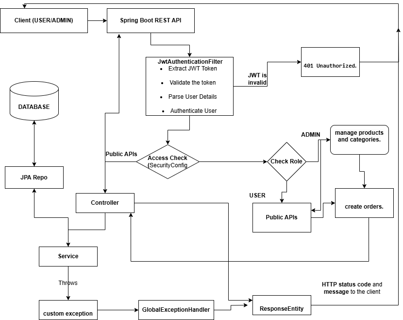

# E-Commerce RESTful API with Spring Boot

This project is a Spring Boot-based RESTful API for an e-commerce platform. It supports user registration, product and category management, and order placement, with JWT authentication and role-based access control.

## Features

1. **User Management**
    - User registration and login
    - Role-based access control (ADMIN / USER)
    - Password hashing with BCrypt

2. **Product Management**
    - CRUD operations for products

3. **Category Management**
    - CRUD operations for categories

4. **Order Management**
    - Create and retrieve orders

5. **Security**
    - JWT-based authentication and authorization
    - Spring Security configuration with stateless sessions


## Entity-Relationship Diagram (ERD)


## API Request Flow Diagram 



### 📌 **Data Flow Explanation**

### 1. Client Request
- Users send HTTP requests (e.g., registration, product retrieval) using REST clients (Postman, Angular frontend, etc.).

### 2. Security Layer
- Incoming requests pass through `JwtAuthenticationFilter`.
- If the request is for public endpoints (e.g., `/api/auth/**`), it's allowed without authentication.
- For protected routes (e.g., `/api/products`, `/api/orders`), JWT is validated.
- Access is granted based on the user's role (e.g., `ADMIN`, `USER`).

### 3. Controller Layer
- Routes valid requests to the corresponding controllers (e.g., `ProductController`, `OrderController`).
- Handles CRUD operations for users, products, categories, and orders.

### 4. Service Layer
- Business logic for creating, updating, retrieving, and deleting entities.
- Uses `UserService`, `ProductService`, etc., for interacting with the database.

### 5. Repository Layer (JPA)
- CRUD operations are performed via `JpaRepository` interfaces.
- Data is stored/retrieved from MySQL.

### 6. Response
- Successful responses return the requested data (e.g., product list).
- Errors trigger the `GlobalExceptionHandler`, returning appropriate HTTP status codes.


## Technologies Used

- Java 17
- Spring Boot (Web, Data JPA, Security)
- MySQL
- JWT (JSON Web Token)
- Lombok

## Endpoints

### Authentication

- `POST /api/auth/register` - Register a new user
- `POST /api/auth/login` - Login and receive a JWT

### Products

- `GET /api/products/public` - Get all products (Public)
- `POST /api/products` - Create a product (ADMIN)
- `GET /api/products/{id}` - Get product by ID (ADMIN)
- `PUT /api/products/{id}` - Update a product (ADMIN)
- `DELETE /api/products/{id}` - Delete a product (ADMIN)

### Categories

- `GET /api/categories` - Get all categories (ADMIN)
- `POST /api/categories` - Create a category (ADMIN)
- `GET /api/categories/{id}` - Get category by ID (ADMIN)
- `PUT /api/categories/{id}` - Update a category (ADMIN)
- `DELETE /api/categories/{id}` - Delete a category (ADMIN)

### Orders

- `POST /api/orders` - Place an order (USER, ADMIN)
- `GET /api/orders/{id}` - Get order by ID (USER, ADMIN)
- `PUT /api/orders/{id}` - Update an order (ADMIN)
- `DELETE /api/orders/{id}` - Delete an order (ADMIN)

## Setup Instructions

1. Clone the repository:

    ```bash
    git clone <https://github.com/santoshBichukale/ecom_gradle_project>
    cd e-commerce-api
    ```

2. Configure database:

   Update `application.properties` with your MySQL credentials.

3. Build and run the application:

    ```bash
    ./mvnw spring-boot:run
    ```

## Testing

- Use Postman or similar tool to test the API endpoints.
- Ensure to pass the JWT token in the `Authorization` header for protected routes.

## Future Enhancements

- Add payment gateway integration
- Implement product reviews and ratings
- Improve search and filter functionality

