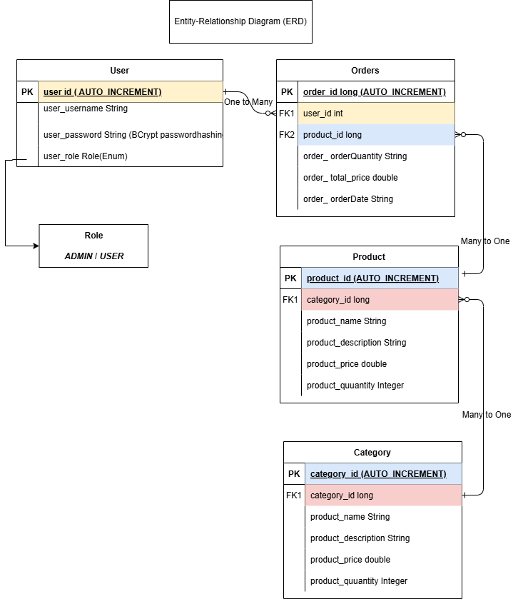

# E-Commerce RESTful API with Spring Boot

This project is a Spring Boot-based RESTful API for an e-commerce platform. It supports user registration, product and category management, and order placement, with JWT authentication and role-based access control.

## Features

1. **User Management**
    - User registration and login
    - Role-based access control (ADMIN / USER)
    - Password hashing with BCrypt

2. **Product Management**
    - CRUD operations for products

3. **Category Management**
    - CRUD operations for categories

4. **Order Management**
    - Create and retrieve orders

5. **Security**
    - JWT-based authentication and authorization
    - Spring Security configuration with stateless sessions


## Entity-Relationship Diagram (ERD)



## 📊 **System Architecture - Data Flow**

```
                         +---------------------------+
                         |        Client (User)      |
                         +------------+--------------+
                                      |
                         +------------v--------------+
                         |    Spring Boot REST API   |
                         +------------+--------------+
                                      |
     +-------------------------------+--------------------------------+
     |                               |                                |
+----v----+                 +--------v---------+            +---------v-------+
|  Security|                 |    Controllers   |            |  Exception     |
|  Layer   |                 | (Product, User,  |            |  Handling      |
|          |                 | Category, Order) |            |               |
+----+----+                 +--------+---------+            +---------+-----+
     |                               |                                |
     |         +---------------------+-----------------+              |
     |         |                                       |              |
+----v----+ +---v---+                            +----v-----+   +----v----+
|  Auth   | |  Role |                            |  Service |   | Error   |
| Filter  | | Check |                            |  Layer   |   | Handler |
+---------+ +-------+                            +----+-----+   +---------+
                                                  |
                                                  |
                                             +----v-----+
                                             |   JPA    |
                                             | Repos    |
                                             +----+-----+
                                                  |
                                          +-------v--------+
                                          | Database (H2/  |
                                          | MySQL/Postgres)|
                                          +----------------+
```

### 📌 **Data Flow Explanation**

1. **Client (User):** Initiates requests via HTTP (e.g., product search, user registration).

2. **Spring Boot REST API:** Handles incoming requests and routes them to the appropriate controllers.

3. **Security Layer:**
   - **Auth Filter:** Validates JWT tokens for secure endpoints.
   - **Role Check:** Ensures users have the correct permissions.

4. **Controllers:**
   - Manage core modules: **User**, **Product**, **Category**, **Order**.

5. **Service Layer:**
   - Contains business logic and interacts with repositories.

6. **Exception Handling:**
   - Captures and returns meaningful error responses to the client.

7. **JPA Repositories:**
   - Interface with the database to perform CRUD operations.

8. **Database:**
   - Supports **H2**, **MySQL**, or **Postgres** for storing application data.


## Technologies Used

- Java 17
- Spring Boot (Web, Data JPA, Security)
- MySQL
- JWT (JSON Web Token)
- Lombok

## Endpoints

### Authentication

- `POST /api/auth/register` - Register a new user
- `POST /api/auth/login` - Login and receive a JWT

### Products

- `GET /api/products/public` - Get all products (Public)
- `POST /api/products` - Create a product (ADMIN)
- `GET /api/products/{id}` - Get product by ID (ADMIN)
- `PUT /api/products/{id}` - Update a product (ADMIN)
- `DELETE /api/products/{id}` - Delete a product (ADMIN)

### Categories

- `GET /api/categories` - Get all categories (ADMIN)
- `POST /api/categories` - Create a category (ADMIN)
- `GET /api/categories/{id}` - Get category by ID (ADMIN)
- `PUT /api/categories/{id}` - Update a category (ADMIN)
- `DELETE /api/categories/{id}` - Delete a category (ADMIN)

### Orders

- `POST /api/orders` - Place an order (USER, ADMIN)
- `GET /api/orders/{id}` - Get order by ID (USER, ADMIN)
- `PUT /api/orders/{id}` - Update an order (ADMIN)
- `DELETE /api/orders/{id}` - Delete an order (ADMIN)

## Setup Instructions

1. Clone the repository:

    ```bash
    git clone <repository-url>
    cd e-commerce-api
    ```

2. Configure database:

   Update `application.properties` with your MySQL credentials.

3. Build and run the application:

    ```bash
    ./mvnw spring-boot:run
    ```

## Testing

- Use Postman or similar tool to test the API endpoints.
- Ensure to pass the JWT token in the `Authorization` header for protected routes.

## Future Enhancements

- Add payment gateway integration
- Implement product reviews and ratings
- Improve search and filter functionality

